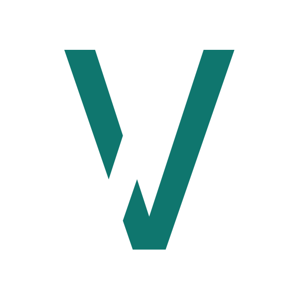

<div align="center">
   <a href="https://github.com/nico-mayer/vide">
    
  </a>
  <h2><b>Vide</b></h2>
</div>

<p align='center'>
Vue3 + Vite Starter Template, super leightweight Targeted for beginners
</p>

<br>

<p align='center'>
The Goal was to create a super lightweight Vite Starter template with as few dependencies as possible, but at the same time provide a good amount of utility.
To deliver a clean entry point for newcomers and advanced Vue + Vite users.
</p>

<br>

<p align='center'>
<a href="https://vide-iota.vercel.app/" target="_blank">Live Demo</a>
</p>

<br>

### You want SSR?

Check out [videNuxt](https://github.com/Nico-Mayer/videNuxt) - Nuxt 3 Version of Vide


## Get Started

```bash
npx degit nico-mayer/vide my-vide-app

cd my-vide-app

yarn # If you don't have yarn installed, run: npm install

yarn dev # or npm run dev to start the development server
```

<br>

## Features

- ⚡️ [Vue 3](https://github.com/vuejs/vue-next), [Vite 2](https://github.com/vitejs/vite)

- 🌙 Easy Custumizable Dark Mode

- 🗂 [File based routing]

- 📦 Components auto importing

- 🎨 [UnoCSS](https://github.com/antfu/unocss) - the instant on-demand atomic CSS engine

- 😃 [Use icons from any icon sets with classes](https://github.com/antfu/unocss/tree/main/packages/preset-icons)

- 🔥 Use the [new `<script setup>` syntax](https://github.com/vuejs/rfcs/pull/227)

- 💪 TypeScript

<br>

## Pre-packed

### UI Frameworks

- [UnoCSS](https://github.com/antfu/unocss) - The instant on-demand atomic CSS engine.

### Icons

- [Iconify](https://iconify.design) - use icons from any icon sets [🔍Icônes](https://icones.netlify.app/)
- [Pure CSS Icons via UnoCSS](https://github.com/antfu/unocss/tree/main/packages/preset-icons)

### Plugins

- [Vue Router](https://github.com/vuejs/vue-router)
  - [`vite-plugin-pages`](https://github.com/hannoeru/vite-plugin-pages) - file system based routing

### Coding Style

- Use Composition API with [`<script setup>` SFC syntax](https://github.com/vuejs/rfcs/pull/227)

### Dev tools

- [TypeScript](https://www.typescriptlang.org/)

- [VS Code Extensions](./.vscode/extensions.json)
  - [Vite](https://marketplace.visualstudio.com/items?itemName=antfu.vite) - Fire up Vite server automatically
  - [Volar](https://marketplace.visualstudio.com/items?itemName=johnsoncodehk.volar) - Vue 3 `<script setup>` IDE support
  - [Iconify IntelliSense](https://marketplace.visualstudio.com/items?itemName=antfu.iconify) - Icon inline display and autocomplete

> Vide requires Node >=14

### Build

To build the App, run

```bash
yarn build
```

And you will see the generated files in `dist` that are ready to be served.

<br>
## Roadmap

- [x] Implement File based routing
- [x] Add unoCSS with pure css icons
- [ ] Write guide for custumizing dark mode
- [ ] Improve about  page content

<br>

<p align="center">This template is inspired by <a href="https://github.com/antfu/vitesse">vitesse</a> and <a href="https://github.com/alvarosabu/vitesome">vitesome</a></p>
